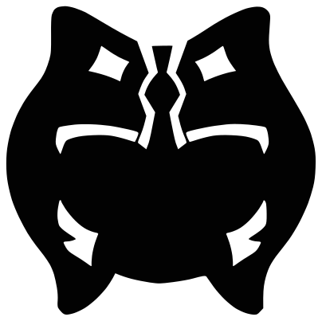

<p align="center">
    <a href="http://padawanpath.dev" target="_blank" rel="noopener noreferrer">
        
    </a>
</p>

<p align="center" style="font-size: 1.17em; font-weight: bold;">👋 ¡Hey! Soy Yellow, y me dedico a <strong>programar y a crear contenido</strong> en <a href="http://padawanpath.dev">Padawan Path</a> 👋</p>

</br>

 ```python
from typing import List
from datetime import datetime


class FellowDeveloper:
    def __init__(self, user: str, location: str, fun_fact: str, hobbies: List[str]):
        self.user = user
        self.location = location
        self.fun_fact = fun_fact
        self.hobbies = ", ".join(hobbies)

    def get_introduction(self) -> str:
        return f"""
        ----------------------------------
        💫 Introducción 💫
        ----------------------------------
        👋 Nombre: {self.user}
        📍 País: {self.location}
        👀 Dato curioso: {self.fun_fact}
        🦄 Hobbies: {self.hobbies}
        """

    def get_goals(self) -> str:
        return f"""
        ----------------------------------
        🚀 Metas para el {datetime.now().year} 🚀
        ----------------------------------
        💻 Crear contenido divulgativo
        🐹 Aprender Golang
        📝 Contribuir a proyectos open source
        """

    def introduce_me(self) -> None:
        introduction_text = self.get_introduction() + self.get_goals()
        print(introduction_text)


if __name__ == "__main__":
    yellow = FellowDeveloper(
        user="Yellow 💫",
        location="España 🌍",
        fun_fact="Creo contenido en Padawan Path 📼",
        hobbies=['🎵 Música urbana', '🎮 Gaming', '👾 Ciencia ficción']
    )
    yellow.introduce_me()
 ```

## Main skills

[](https://skillicons.dev)

## ¡Conecta conmigo!

<p>
    <a href="http://www.padawanpath.dev"></a>
    <a href="mailto:yellow@padawanpath.dev"></a>
    <a href="https://twitter.com/yellow_cmd"></a>
</p>
